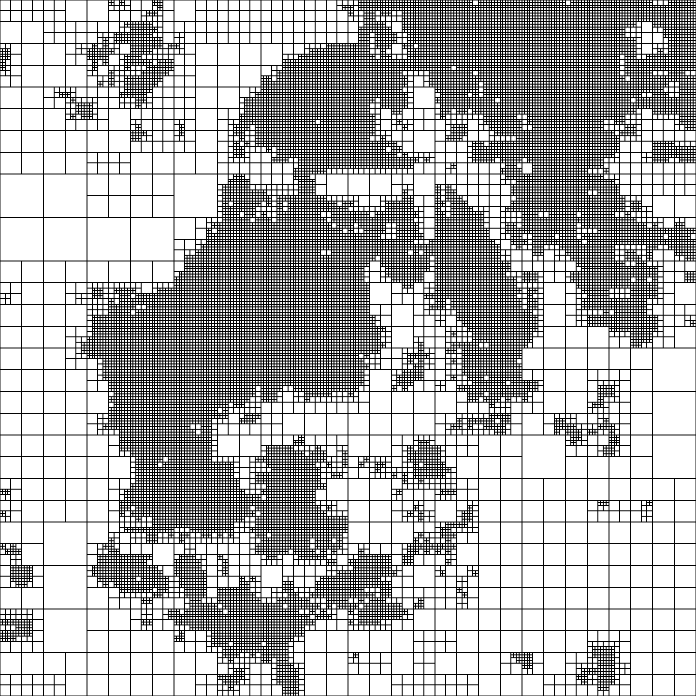

## Matrix algorithms

### 1.Recursive Matrix Multiplication
Implements Binet and Strassen recursive multiplication algorithms for square matrices, counting floating-point operations (FLOPs) and measuring performance.

### 2.Recursive Matrix Inversion and Factorization

Includes recursive algorithms for matrix inversion, Gaussian elimination, and LU factorization, with FLOP counting and performance analysis.

### 3.Hierarchical SVD-Based Matrix Compression

Implements recursive compression of matrices (including RGB images) using truncated SVD, allowing visualization of compressed matrices and reconstructed images.

### 4.Compression and Multiplication of 3D Grid Matrices

Applies hierarchical compression to large structured 3D grid matrices, supporting multiplication by vectors and by itself, and evaluating accuracy and experimental complexity.

  
  
  

